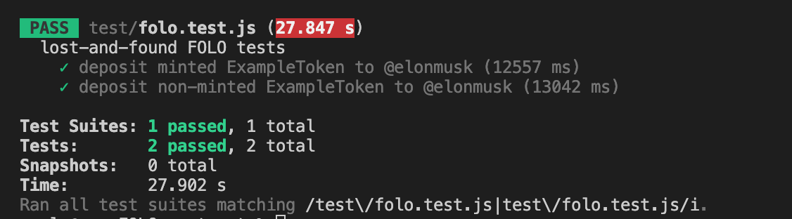

## FOLO @HeyFOLO
send and receive FLOW tokens (FTs, NFTs) with just social handles or emails

_no wallets, no passwords,_ **straight to fun and business**

- contract source: https://github.com/0xStruct/FOLO-contract
- ui source: https://github.com/0xStruct/FOLO-ui

### About this contract
This contract is built upon https://github.com/Flowtyio/lost-and-found
to enable depositing of vaults/collections into _bins_ using social handles and emails

So, tokens, NFTs can now be sent to literally any web2 users.
Then these social handles and emails are later linked to app-custodied wallets
when users login with their social accounts and emails.

To learn more, please refer to the original contract's README

_To run tests_

`npm install`
if you haven't done so

`npm test`
this will run `test/folo.test.js`

Please refer to .cdc files inside
`scripts/Folo` and `transactions/Folo` folders

### Next steps
I plan to liaise with Flowty team to see if this could be added into the core or develop as an extension.

Next obvious integrations are with Drizzle and Floats
